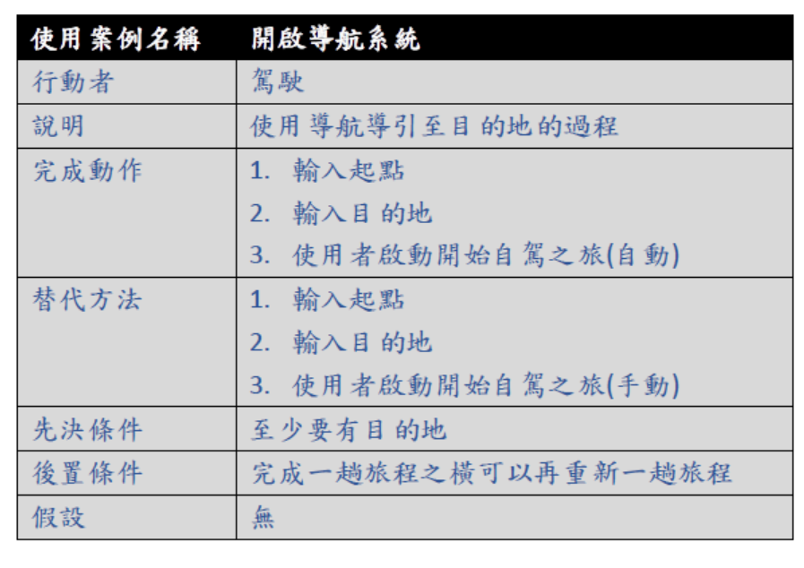

# 2020_OO
-------------------------------------------------
### 小組成員：
### 資管3甲 C107118111 蕭仁豪(組員)
### 資管3甲 C107118137 蕭煜宸(組員)
### 資管3甲 C107118151 黃仲偉(組長)
#### 工作分配：
#### 蕭仁豪(實際成品製作)
#### 蕭煜宸(文書及報告)
#### 黃仲偉(實際成品製作)
-------------------------------------------------
### 題目：心念駕車
-------------------------------------------------
#### 內容：有鑑於現在的人越來越懶惰的緣由，我們希望能夠研發出可以自動駕駛的車輛，
#### 讓我們在未來的生活中能在長途旅程中更加的輕鬆。
-------------------------------------------------
### **甘特圖**

-------------------------------------------------
### **CPM圖**

-------------------------------------------------
### **功能性需求**
#### 1. 不需人力駕車
#### 2. 輸入起始地及目的地即可開啟導航模式導引至目的地
#### 3. 可以自行判算各個交通號誌該做甚麼事情
### **非功能性需求**
#### 1. 使用者啟動整個系統需約花30秒鐘
#### 2. 導航系統所導出的路徑未必是最短路徑
#### 3. 使用介面淺顯易懂使用者可以快速上手
-------------------------------------------------
### **功能分解圖(FDD)**

-------------------------------------------------
### **需求分析**
-------------------------------------------------
### **使用案例**

# 幹
