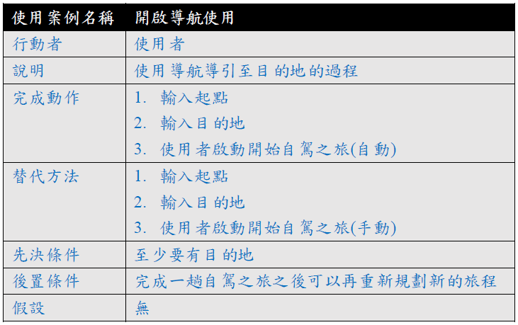
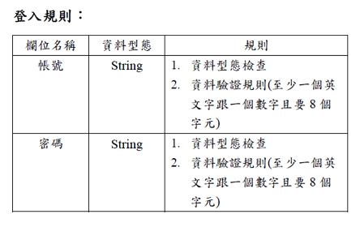

### 心念駕車
-------------------------------------------------
### 小組成員：
### 資管3甲 C107118111 蕭仁豪(組員)
### 資管3甲 C107118137 蕭煜宸(組員)
### 資管3甲 C107118151 黃仲偉(組長)
### 資管3乙 C107118250 洪嘉聰(組員)
#### 工作分配：
#### 蕭仁豪(文書及報告)
#### 蕭煜宸(文書及報告)
#### 黃仲偉(實際成品製作)
#### 洪嘉聰(實際成品製作)
-------------------------------------------------
#### 內容：有鑑於現在的人越來越懶惰的緣由，我們希望能夠研發出可以自動駕駛的車輛，
#### 讓我們在未來的生活中能在長途旅程中更加的輕鬆。
-------------------------------------------------
### **甘特圖**

-------------------------------------------------
### **CPM圖**

-------------------------------------------------
### **功能性需求**
#### 1. 不需人力駕車
#### 2. 輸入起始地及目的地即可開啟導航模式導引至目的地
#### 3. 可以自行判算各個交通號誌該做甚麼事情
### **非功能性需求**
#### 1. 使用者啟動整個系統需約花30秒鐘
#### 2. 導航系統所導出的路徑未必是最短路徑
#### 3. 使用介面淺顯易懂使用者可以快速上手
-------------------------------------------------
### **功能分解圖(FDD)**

-------------------------------------------------
### **需求分析**
#### 1. 工程師可以藉由導入地圖資料來更新現有地圖。
#### 2. 工程師可以藉由即時路況監控系統導入路況資料來更新即時路況。
#### 3. 導航系統可以藉由載入地圖資料更新路線規畫。
#### 4. 必須隨時更新路況資訊。
#### 5. 駕駛可以輸入目的地給導航系統規劃路線。
#### 6. 假如路況出現突發狀況，導航系統必須即時更改路線規劃。
-------------------------------------------------
### **使用案例**

-------------------------------------------------
### **使用案例圖**

-------------------------------------------------
### **系統環境圖**

-------------------------------------------------
### **圖0**

-------------------------------------------------
### **UML**

-------------------------------------------------
### **系統維護_循序圖**

-------------------------------------------------
### **系統維護_活動圖**

-------------------------------------------------
### **開啟導航_循序圖**

-------------------------------------------------
### **開啟導航_活動圖**

-------------------------------------------------
### **語音小助理_循序圖**

-------------------------------------------------
### **語音小助理_活動圖**

-------------------------------------------------
### **分鏡板**

-------------------------------------------------
### **實體關係圖**

